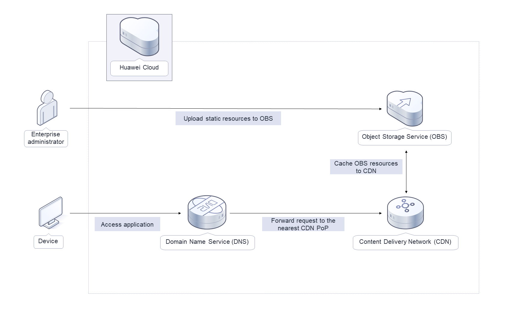
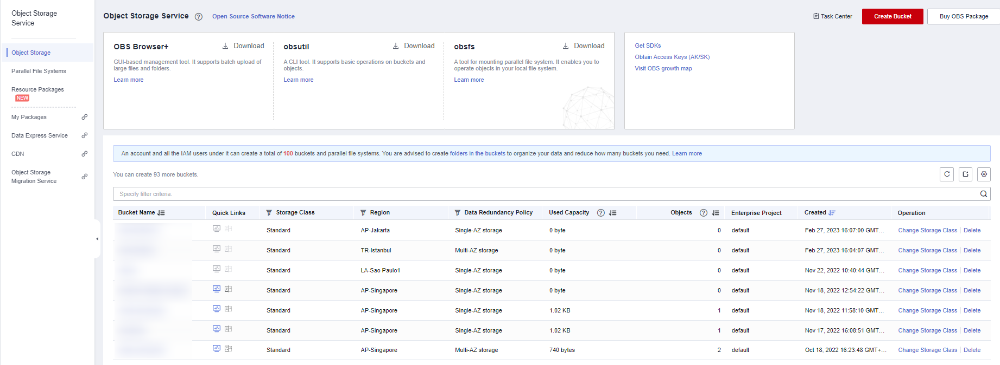
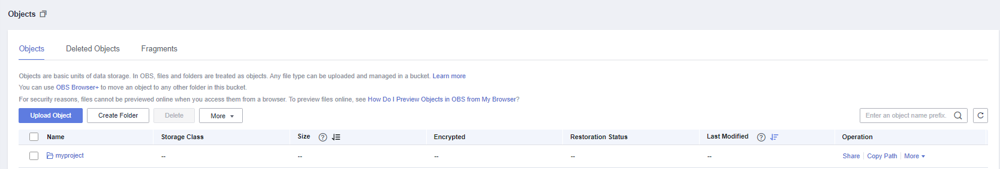

[TOC]

**Solution Overview**
===============
Based on Huawei Cloud [Content Delivery Network (CDN)](https://www.huaweicloud.com/intl/en-us/product/cdn.html) and [Object Storage Service (OBS)](https://www.huaweicloud.com/intl/en-us/product/obs.html), this solution provides turnkey download acceleration for your static resources. It applies to the following scenarios:

1. File download, for example, websites that provide download services based on HTTP or HTTPS, game clients, and app stores

2. Audio and video on demand, such as online education, video sharing, and music or video on demand

3. Image loading, for example, portal websites, e-commerce platforms, news apps, and user-generated content (UGC) applications

For more details about this solution, visit: https://www.huaweicloud.com/intl/en-us/solution/implementations/cdnda.html


**Architecture**
---------------


**Architecture Description**
---------------
This solution will:
1. Create an OBS bucket to store static resources such as images, videos, and software packages of websites, forums, apps, and games.
2. Set the OBS bucket as the origin server of the acceleration domain name in CDN, so that data in the bucket can be cached to CDN points of presence (PoPs), accelerating the access and download of static application resources and reducing bandwidth and traffic costs.

**File Structure**
---------------

``` lua
huaweicloud-solution-cdn-download-acceleration
├── download-acceleration-cdn.tf.json -- Resource orchestration template
```
**Getting Started**
---------------
1. View the bucket list.

	Log in to [OBS](https://console-intl.huaweicloud.com/obs/?region=ap-southeast-3&locale=en-us#/obs/manager/buckets) Console and view the list of available OBS buckets.

	Figure 1 OBS bucket list

	

2. Upload resources.

	Select the OBS bucket created during solution deployment and upload application resources to accelerate.

	Figure 2 Uploading resources

	

3. Verify services.

	Visit the acceleration domain name on a client. If an accelerated resource can be downloaded, the acceleration configuration is successful.
